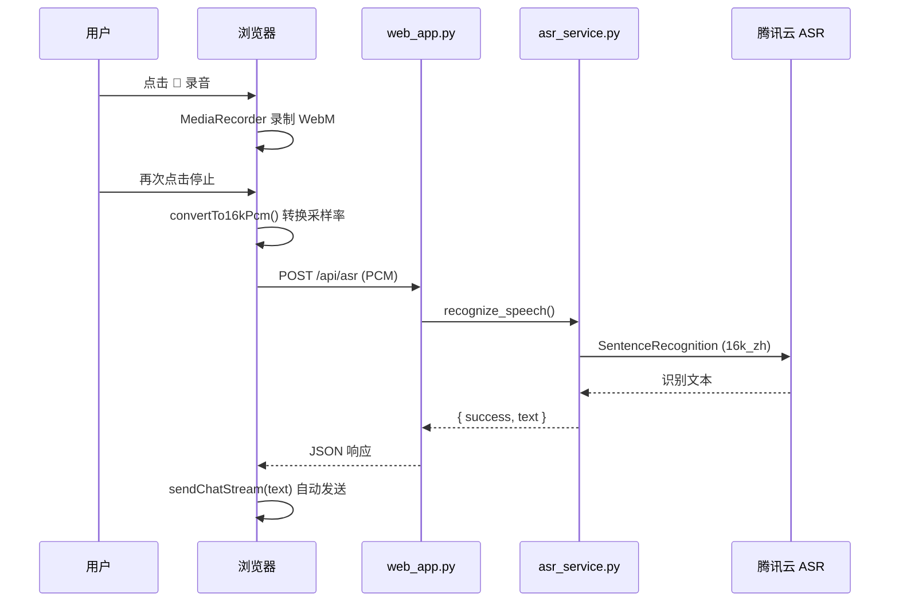
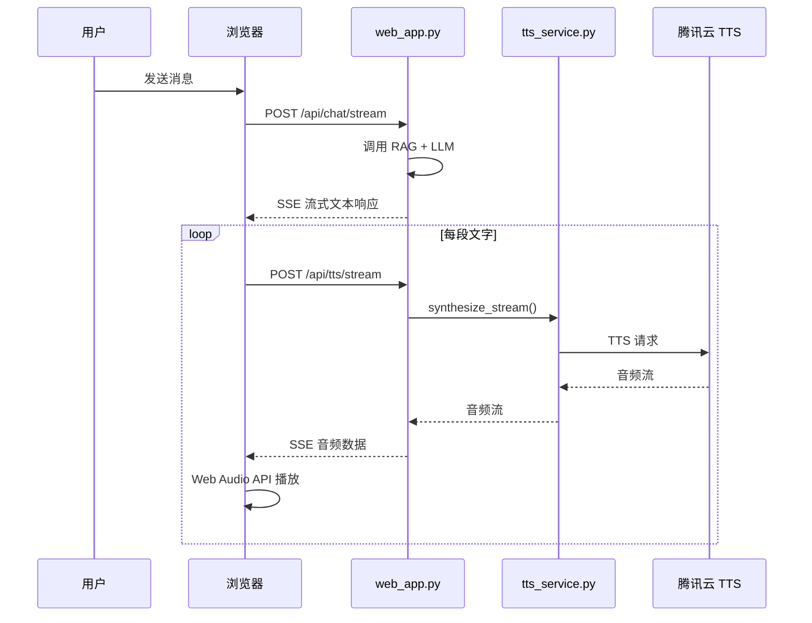

# 🌤️ 智能天气穿搭助手

基于 **RAG (Retrieval-Augmented Generation)** 的智能天气穿搭助手，结合实时天气数据与知识库检索，为用户提供个性化的穿衣建议和出行指导。

---

## ✨ 功能特点

### 🎯 核心功能
- **天气查询** - 获取实时天气数据和未来一周预报
- **穿搭建议** - 根据气温、湿度、风力智能推荐穿搭方案
- **智能聊天** - 支持自然语言交互，回答天气相关问题
- **数据分析** - 温度趋势分析和舒适度评估

### 🔊 语音交互
- **语音输入** - 浏览器录音 + 腾讯云 ASR 语音识别
- **流式语音输出** - 文字回复流式显示，TTS 按句合成并逐段播放

### 🌍 定位服务
- **自动定位** - 浏览器 GPS + IP 定位，自动获取城市天气
- **手动选择** - 支持 20+ 热门城市手动选择

### ☀️ 健康提醒
- **紫外线提醒** - 提供紫外线强度建议
- **降雨预报** - 提醒是否需要带伞

---

## 🛠️ 技术栈

### 后端
| 技术 | 版本 | 用途 |
|------|------|------|
| Python | 3.10+ | 开发语言 |
| Flask | 2.0+ | Web 框架 |
| Flask-Sock | 0.6+ | WebSocket 支持 |
| LangChain | 0.1+ | RAG 与 LLM 编排 |
| ChromaDB | 0.4+ | 向量数据库 |
| Sentence Transformers | 2.2+ | 文本向量化 |

### 人工智能
| 服务 | 说明 |
|------|------|
| 智谱 AI GLM-4-Flash | 大语言模型 |
| 腾讯云 ASR | 语音识别 |
| 腾讯云 TTS | 语音合成 |

### 数据来源
| 服务 | 说明 |
|------|------|
| Open-Meteo | 天气数据 API |
| 和风天气 API | 备用天气数据源 |

### 前端
- HTML5 + CSS3 + JavaScript
- MediaRecorder API（录音）
- Web Audio API（音频播放）

---

## 📁 项目结构

```
weather_outfit_agent/
├── templates/                 # 前端模板
│   └── index.html             # 主页面（支持语音交互）
├── knowledge_base/            # RAG 知识库
│   ├── outfit_guide.md        # 四季穿搭指南
│   ├── travel_guide.md        # 旅游攻略
│   └── weather_health.md      # 天气与健康知识
├── chroma_db/                 # ChromaDB 向量存储目录
├── web_app.py                 # Flask 主服务（推荐）
├── web_server.py              # 简易 HTTP 服务
├── rag_system.py              # 完整 RAG 系统（基于 ChromaDB）
├── simple_rag_system.py       # 简化版 RAG（关键词匹配）
├── chat_chains.py             # LangChain 对话链
├── chat_common.py             # 聊天公共模块
├── chat_handler.py            # 聊天处理器
├── langchain_agent.py         # LangChain Agent
├── weather_api.py             # 天气数据 API
├── weather_prompt.py          # Prompt 模板配置
├── asr_service.py             # 语音识别服务
├── tts_service.py             # 语音合成服务
├── streaming_tts.py           # 流式 TTS 服务
├── conversation_manager.py    # 对话历史管理
├── location_service.py        # 定位服务
├── outfit_recommender.py      # 穿搭推荐逻辑
├── analyzer.py                # 数据分析模块
├── visualizer.py              # 可视化模块
├── config.py                  # 配置文件
├── env_config.py              # 环境变量配置
├── requirements.txt           # 依赖列表
└── render.yaml                # Render 部署配置
```

---

## 🚀 快速开始

### 环境要求
- Python 3.10+
- pip 包管理器

### 安装依赖

```bash
cd weather_outfit_agent
# 生产 / Render 部署（轻量，约 150–250MB）
pip install -r requirements-prod.txt

# 本地完整开发（含 ChromaDB、matplotlib 等）
pip install -r requirements-dev.txt
```

### 设置环境变量

```bash
# 智谱 AI API Key（必需）
export ZHIPU_API_KEY=your_api_key_here

# 腾讯云语音服务（可选，语音功能需要）
export TENCENT_SECRET_ID=your_secret_id
export TENCENT_SECRET_KEY=your_secret_key
export TENCENT_APP_ID=your_app_id

# 和风天气 API（可选，备用数据源）
export API_KEY=your_hefeng_key
```

### 运行服务

```bash
python web_app.py
```

服务启动后访问: http://localhost:5000

---

## 🧠 RAG 系统架构

### 知识库结构

| 文件 | 内容 | 用途 |
|------|------|------|
| `outfit_guide.md` | 四季穿搭指南、材质选择、颜色搭配 | 穿搭建议 |
| `weather_health.md` | 健康提示、防晒措施、空气质量 | 健康提醒 |
| `travel_guide.md` | 旅游攻略、景点推荐、美食介绍 | 出行建议 |

### RAG 工作流程

```
用户查询 + 天气上下文
        ↓
  增强查询构建
        ↓
ChromaDB 向量检索 (k=3)
        ↓
  检索结果格式化
        ↓
  Prompt 模板构建
        ↓
  GLM-4-Flash 生成回答
```

### 文档处理配置

- **Chunk 大小**: 500 字符
- **Chunk 重叠**: 50 字符
- **分隔符**: `\n\n`, `\n`, `。`, `！`, `？`, `；`, `，`
- **Embedding 模型**: `shibing624/text2vec-base-chinese`

---

## 🔌 API 接口

### 1. 获取天气数据

```
GET /api/weather?city=<城市名>
```

**示例**:
```bash
curl "http://localhost:5000/api/weather?city=成都"
```

**响应示例**:
```json
{
  "city": "成都",
  "current": {
    "temp": "29",
    "condition": "多云",
    "humidity": "65",
    "wind": "东北风 2级"
  },
  "forecast": [...],
  "outfit": {
    "top": "短袖T恤",
    "bottom": "薄长裤",
    "shoes": "帆布鞋",
    "accessory": "太阳镜"
  }
}
```

### 2. 聊天交互

**普通聊天**:
```
POST /api/chat
Content-Type: application/json

{
    "message": "明天天气怎么样？",
    "cityData": {...}
}
```

**流式聊天**:
```
POST /api/chat/stream
Content-Type: application/json

{
    "message": "今天穿什么？",
    "cityData": {...}
}
```

### 3. 语音识别

```
POST /api/asr
Content-Type: multipart/form-data

file: recording.pcm (16kHz, 16bit, 单声道)
format: pcm
```

### 4. 语音合成（流式）

```
POST /api/tts/stream
Content-Type: application/json

{
    "text": "今天成都天气不错",
    "voice_type": 101007,
    "stream": "sse"
}
```

### 5. 定位服务

```
GET /api/locate
GET /api/locate?lat=<纬度>&lon=<经度>
```

---

## 🗣️ 语音交互流程

### 语音识别流程



### 语音合成流程



---

## 🌆 支持的城市

- **一线城市**: 北京、上海、广州、深圳
- **新一线城市**: 杭州、成都、武汉、西安、重庆、南京、天津、苏州
- **热门城市**: 郑州、长沙、青岛、沈阳、大连、厦门、宁波、昆明

---

## 📝 使用示例

### 天气查询
```
用户: 成都天气怎么样？
助手: 📅 成都今日天气：多云 29°C
      湿度：65%，风力：东北风 2级
      未来几天预报：
      - 05/28: 晴 22~33°C
      - 05/29: 多云 23~31°C
```

### 穿搭建议
```
用户: 今天穿什么？
助手: 👔 成都今日穿搭建议：
      上衣：短袖T恤
      下装：薄长裤
      鞋子：帆布鞋
      配饰：太阳镜
```

### 语音输入
```
用户: [点击 🎤 说「明天天气怎么样？」]
系统: 识别完成后自动发送，并流式返回文字与语音
```

### 紫外线提醒
```
用户: 今天紫外线强吗？
助手: 紫外线强度较高!建议涂抹防晒霜、戴遮阳帽 🧴🕶️
```

---

## 🚢 部署

### Render 部署

1. Fork 本仓库
2. 在 Render 上创建 Web Service（可使用 `render.yaml`）
3. **Build Command**：`pip install -r requirements-prod.txt`（勿装 chromadb / sentence-transformers，否则超 512MB）
4. **Start Command**：
   ```bash
   gunicorn --bind 0.0.0.0:$PORT --workers 1 --threads 2 --timeout 120 --max-requests 500 web_app:app
   ```
5. 在 Render 控制台设置环境变量（**不需要 .env 文件**）：
   - `ZHIPU_API_KEY`（必需，AI 对话）
   - `TENCENT_SECRET_ID` / `TENCENT_SECRET_KEY` / `TENCENT_APP_ID`（可选，语音）
6. **Clear build cache & deploy** 重新部署

访问 `/api/health` 可检查 `llm_configured` / `tts_configured` 是否为 `true`。

**常见错误：**
- `No open ports detected` → Start Command 未用 gunicorn
- `Ran out of memory (512MB)` → Build 用了完整 `requirements.txt`，请改 `requirements-prod.txt`

### 本地开发

```bash
# 安装依赖
pip install -r requirements.txt

# 设置环境变量
export ZHIPU_API_KEY=your_key

# 运行服务
python web_app.py

# 访问
open http://localhost:5000
```

---

## 📊 项目配置

### RAG 配置

在 `rag_system.py` 中可调整：
- `chunk_size`: 文档分块大小（默认 500）
- `chunk_overlap`: 块重叠大小（默认 50）
- `k`: 检索结果数量（默认 3）

### LLM 配置

在 `chat_common.py` 中可调整：
- `model`: 模型名称（默认 `glm-4-flash`）
- `temperature`: 温度参数（默认 0.7）
- `max_tokens`: 最大输出长度（默认 800）

---

## 📜 许可证

MIT License

---

## 🤝 贡献

欢迎提交 Issue 和 Pull Request！

---

## 📧 联系方式

如有问题或建议，请通过以下方式联系：
- 提交 Issue
- 发送邮件

---

**更新时间**: 2026年5月
