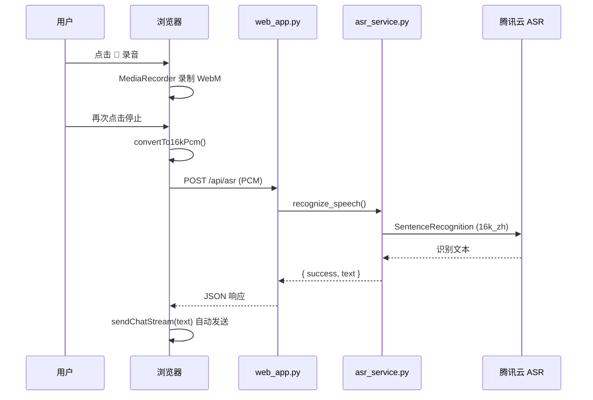

# 智能天气穿搭助手

一个基于 Python 的智能天气穿搭助手，提供天气查询、穿搭建议和聊天交互功能，支持语音输入与流式语音输出。

## 功能特点

- 🌤️ **天气查询** - 获取实时天气数据和未来一周预报
- 👔 **穿搭建议** - 根据天气情况智能推荐穿搭方案
- 💬 **智能聊天** - 支持自然语言交互，回答天气相关问题
- 🎤 **语音输入** - 浏览器录音 + 腾讯云 ASR 语音识别，识别后自动发送
- 🔊 **流式语音输出** - 文字回复流式显示，TTS 按句合成并逐段播放
- 📍 **自动定位** - 浏览器 GPS + IP 定位，自动获取城市天气
- 📊 **数据分析** - 温度趋势分析和舒适度评估
- ☀️ **紫外线提醒** - 提供紫外线强度建议
- ☔ **降雨预报** - 提醒是否需要带伞

## 技术栈

- **后端**: Python 3.10+
- **Web框架**: Flask + Flask-Sock (WebSocket)
- **语音识别**: 腾讯云 ASR（一句话识别）
- **语音合成**: 腾讯云 TTS（流式按句播放）
- **大模型**: 智谱AI GLM-4-Flash
- **LangChain**: 用于工具调用和 RAG 系统
- **天气API**: Open-Meteo
- **前端**: HTML5 + CSS3 + JavaScript (MediaRecorder / Web Audio API)

## 项目结构

```
weather_outfit_agent/
├── templates/              # 前端模板
│   └── index.html          # 主页面
├── knowledge_base/         # RAG 知识库
│   ├── outfit_guide.md     # 穿搭指南
│   ├── travel_guide.md     # 旅行指南
│   └── weather_health.md   # 天气健康知识
├── web_app.py              # Flask 主服务（推荐）
├── web_server.py           # 简易 HTTP 服务
├── asr_service.py          # 语音识别服务
├── tts_service.py          # 语音合成服务
├── streaming_tts.py        # 流式 TTS 服务
├── conversation_manager.py # 对话历史管理
├── langchain_agent.py      # LangChain Agent
├── simple_rag_system.py    # RAG 检索系统
├── requirements.txt        # 依赖列表
├── Procfile                # 部署配置
└── render.yaml             # Render 部署配置
```

## 快速开始

### 环境要求

- Python 3.10+
- pip 包管理器

### 安装依赖

```bash
pip install -r requirements.txt
```

### 设置环境变量

```bash
# 智谱 AI API Key
export ZHIPU_API_KEY=your_api_key_here

# 腾讯云语音服务（语音识别 / 语音合成）
export TENCENT_SECRET_ID=your_secret_id
export TENCENT_SECRET_KEY=your_secret_key
export TENCENT_APP_ID=your_app_id
```

### 运行服务

```bash
python web_app.py
```

服务启动后访问: http://localhost:5000

## 语音识别功能说明

整体流程为：**浏览器录音 → 前端转 PCM → 后端调用腾讯云 ASR → 识别完成后自动发送对话**。

### 1. 前端录音（`templates/index.html`）

| 步骤 | 实现 |
|------|------|
| 触发 | 点击 🎤 按钮，调用 `toggleRecording()` |
| 采集 | `navigator.mediaDevices.getUserMedia({ audio: true })` 获取麦克风 |
| 录制 | 使用 `MediaRecorder`，优先 `audio/webm;codecs=opus`，每 250ms 收集一段数据 |
| 停止 | 再次点击按钮，停止录制并调用 `uploadAndRecognize()` |

录音过程中按钮变红，顶部显示「正在录音...」提示。

### 2. 音频格式转换（前端）

浏览器录出来的是 **WebM/Opus**，腾讯云 ASR 需要 **16kHz、16bit、单声道 PCM**，因此在浏览器内完成转换：

```
WebM Blob
  → AudioContext.decodeAudioData() 解码
  → OfflineAudioContext 重采样到 16000Hz
  → Float32 转 Int16（s16le）
  → 生成 PCM Blob
```

对应函数：`convertTo16kPcm()`

在前端处理采样率，可避免浏览器原生采样率（44100/48000 Hz）与 ASR 要求的 16000 Hz 不一致导致识别错误，且不依赖服务端安装 ffmpeg。

### 3. 上传与识别请求

转换完成后，通过 `FormData` 上传到 **`POST /api/asr`**：

- `file`：PCM 音频文件
- `format`：`pcm`

识别期间输入框显示「正在识别语音...」，并禁用麦克风按钮。

### 4. 后端 API（`web_app.py`）

**主接口：`POST /api/asr`（当前使用）**

```
接收 multipart 音频
  → recognize_speech(audio_data, format)
  → 返回 JSON：{ success, text, request_id }
```

**备用接口：`POST /api/asr/stream`**

- SSE 流式返回识别文字（逐字推送）
- 当前前端主流程走一次性 JSON 接口

### 5. 识别服务（`asr_service.py`）

核心类为 `ASRService`，调用 **腾讯云一句话识别 API**：

```
ASRService.recognize()
  ├─ 校验音频长度（< 100 字节则失败）
  ├─ _prepare_pcm_audio()  # pcm 直接用；其他格式可用 ffmpeg 转
  └─ _recognize_with_tencent()
       ├─ SentenceRecognitionRequest
       │    · EngSerViceType = "16k_zh"   # 中文 16k
       │    · VoiceFormat = "pcm"
       │    · Data = base64(pcm)
       └─ 返回 resp.Result（识别文本）
```

认证信息来自环境变量：

- `TENCENT_SECRET_ID`
- `TENCENT_SECRET_KEY`
- `TENCENT_APP_ID`

### 6. 识别完成后的行为

识别成功后，前端直接调用：

```javascript
await sendChatStream(data.text.trim());
```

即：**不填入输入框、不弹确认框**，直接把识别文字当作用户消息发送，后续走对话的 **文字流式回复 + 语音流式播报**。

### 语音识别流程图



### 设计要点

1. **采样率在浏览器处理**：避免采样率不匹配导致识别错误。
2. **一次性识别、一次性发送**：输入端不做流式展示，识别完直接发消息。
3. **无 fallback 随机文本**：识别失败返回真实错误，不伪造结果。
4. **腾讯云一句话识别**：适合短语音（单次录音），不是实时边说边识别的 WebSocket 流式 ASR。

## API 接口

### 1. 获取天气数据

```
GET /api/weather?city=<城市名>
```

**示例**:
```bash
curl "http://localhost:5000/api/weather?city=成都"
```

### 2. 聊天交互

```
POST /api/chat
Content-Type: application/json

{
    "message": "明天天气怎么样？",
    "cityData": {...}
}
```

**流式聊天**:
```
POST /api/chat/stream
Content-Type: application/json
```

### 3. 语音识别

```
POST /api/asr
Content-Type: multipart/form-data

file: recording.pcm
format: pcm
```

### 4. 语音合成（流式）

```
POST /api/tts/stream
Content-Type: application/json

{
    "text": "今天成都天气不错",
    "voice_type": 101007,
    "stream": "sse"
}
```

### 5. 定位

```
GET /api/locate
GET /api/locate?lat=<纬度>&lon=<经度>
```

**示例**:
```bash
curl "http://localhost:5000/api/locate"
curl "http://localhost:5000/api/locate?lat=30.57&lon=104.06"
```

## 支持的城市

- 北京、上海、广州、深圳
- 杭州、成都、武汉、西安
- 重庆、南京、天津、苏州
- 郑州、长沙、青岛、沈阳
- 大连、厦门、宁波、昆明

## 功能示例

### 天气查询
```
用户: 成都天气怎么样？
助手: 📅 成都今日天气：多云 29°C...
```

### 穿搭建议
```
用户: 今天穿什么？
助手: 👔 成都今日穿搭建议：短袖T恤...
```

### 语音输入
```
用户: [点击 🎤 说「明天天气怎么样？」]
系统: 识别完成后自动发送，并流式返回文字与语音
```

### 未来预报
```
用户: 明天天气怎么样？
助手: 📅 明天成都天气：晴，温度22~33°C...
```

### 紫外线提醒
```
用户: 今天紫外线强吗？
助手: 紫外线强度较高!建议涂抹防晒霜、戴遮阳帽 🧴🕶️
```

## 部署

### Render 部署

1. Fork 本仓库
2. 在 Render 上创建新的 Web Service
3. 设置环境变量 `ZHIPU_API_KEY`、`TENCENT_SECRET_ID`、`TENCENT_SECRET_KEY`、`TENCENT_APP_ID`
4. 部署即可

## 许可证

MIT License

## 贡献

欢迎提交 Issue 和 Pull Request！